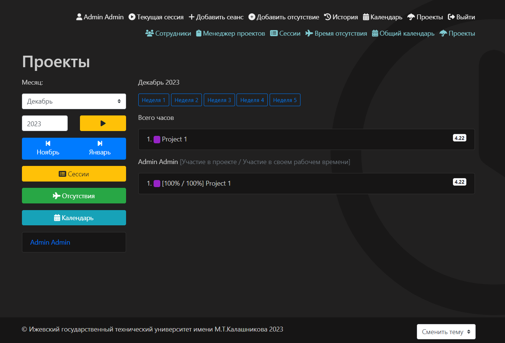

# TimeClock

## Установка

1. Установите TimeClock, используя Composer:

   `composer install`

2. Подготовьте виртуальный хост, указывающий на каталог `/public`.
3. Подготовьте конфигурацию для базы данных по вашему выбору. Разместите ее в `/src/config/db.php`.
4. Измените файл `/src/config/web.php`:

   - `timeZone` (по умолчанию `UTC`),
   - `language` (по умолчанию `ru-RU`; в папке `/src/messages/`),
   - конфигурацию `components > mailer` для отправки электронных писем (необходимо для сброса пароля),
   - конфигурацию `components > formatter` для форматов даты и времени,
   - `params > company` (по умолчанию ``; отображается в подвале и других местах макета),
   - `params > email` (по умолчанию `email@company.com`; используется в качестве адреса отправителя электронной почты для писем),
   - `params > allowedDomains` (по умолчанию `['@company.com']`; массив доменов электронной почты, разрешенных для регистрации).

5. Измените файл `/public/index.php`, установив режим `YII_DEBUG` в `false` и среду `YII_ENV` в `prod`.
6. Примените миграции, выполнив в консоли `php yii migrate`.
7. Запустите веб-сервер и зарегистрируйте первый аккаунт.
8. Если вы хотите, чтобы аккаунт был администратором, выполните в консоли `php yii admin/set ID`, где `ID` - это идентификатор аккаунта в базе данных,
   который необходимо установить (обычно первый - `1`).

## Возможности

- регистрация аккаунта
- сброс пароля
- обновление профиля
- темы
- вход с использованием логина или PIN-кода
- время сессии с заметкой
- время отсутствия с заметкой
- история сессий и времени отсутствия
- календарь
- праздники
- раздел администратора
- REST API
- макет Bootstrap 4
- запросы на отпуск
- проекты
- CSV-загрузка времени сессий для администраторов
- деактивация учетных записей для администраторов

## Скриншот

